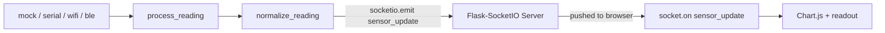

# Dashboard (Debug View)

Live sensor dashboard for the stabilization platform. Supports four data
sources, picked at startup with --source. Currently nothing real to
connect to yet, so mock (the default) is what everyone should run until
the ESP32 side has real data.

## How it works



## Setup

1. Make sure you have Python 3.9+ installed (`python3 --version` to check).

2. From this `dashboard/` folder, create and activate a virtual environment:
   ```
   python3 -m venv env
   source env/bin/activate        # Windows: env\Scripts\activate
   ```

3. Install dependencies:
   ```
   pip install -r requirements.txt
   ```

4. Create your own local config (gitignored, each person's values differ):
   ```
   cp config.example.json config.json
   ```
   Only fill in the fields for whichever source you're actually using.

5. Run the server:
   ```
   python app.py                  # mock (default)
   python app.py --source serial
   python app.py --source wifi
   python app.py --source ble
   ```

6. Open a browser to:
   ```
   http://localhost:5001
   ```
   You should see the dashboard with a connection status badge in the
   header (green once connected), a live-updating chart, and the
   pitch/roll/power readout changing.

## What each source needs in config.json

| Source | Required fields |
|---|---|
| mock | none |
| serial | serial_port (and serial_baud if not 115200) |
| wifi | wifi_url |
| ble | ble_name, ble_characteristic |

A missing field shows up clearly in the terminal and on the status badge,
not as a silent failure.

## Viewing from another device (phone, another laptop)

The server is already bound to your machine's network address (not just
localhost), so as long as the other device is on the **same WiFi network**:

1. Find this machine's local IP address:
   - Mac: `ipconfig getifaddr en0`
   - Windows: `ipconfig` (look for IPv4 Address)
2. On the other device, go to `http://<that-ip>:5001`

Chart.js and Socket.IO are bundled locally now (static/js/vendor/) instead
of loaded from a CDN, so this also works fully offline on the machine
running the server, including over BLE with no WiFi at all.

## Extra info

- **Port 5001, not 5000**: macOS runs AirPlay Receiver on port 5000 by
  default, which blocks Flask from using it. If you ever see a 403 error on
  port 5000, this is why.
- **Firewall prompt**: the first time you run this, macOS may ask whether to
  allow incoming network connections for Python. Allow it, or other devices
  won't be able to reach the dashboard.
- **BLE on macOS**: macOS doesn't expose a device's real Bluetooth address
  to apps, so BLE connects by scanning for the device's advertised name
  instead of an address. Already handled in app.py, just explains why BLE
  works a bit differently than WiFi/serial under the hood.

## File structure

```
dashboard/
  app.py                     <- Flask server + all four data sources
  config.example.json        <- template, copy to config.json
  config.json                <- your own local settings, gitignored
  requirements.txt
  templates/
    index.html                <- page structure
  static/
    js/
      dashboard.js             <- Socket.IO listener + Chart.js
      vendor/
        chart.umd.js            <- Chart.js, bundled locally
        socket.io.min.js        <- Socket.IO client, bundled locally
    css/
      style.css                <- styling
```
